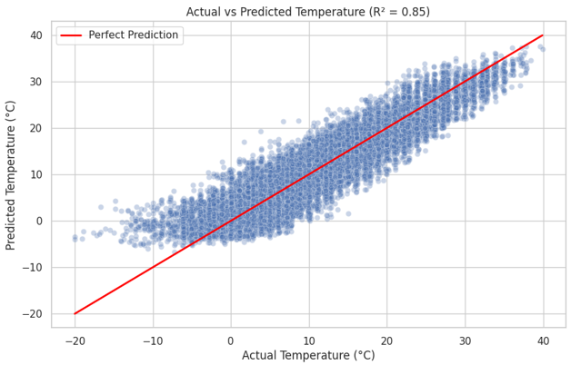
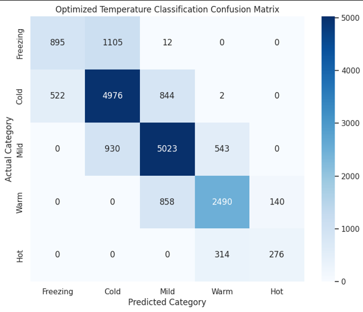
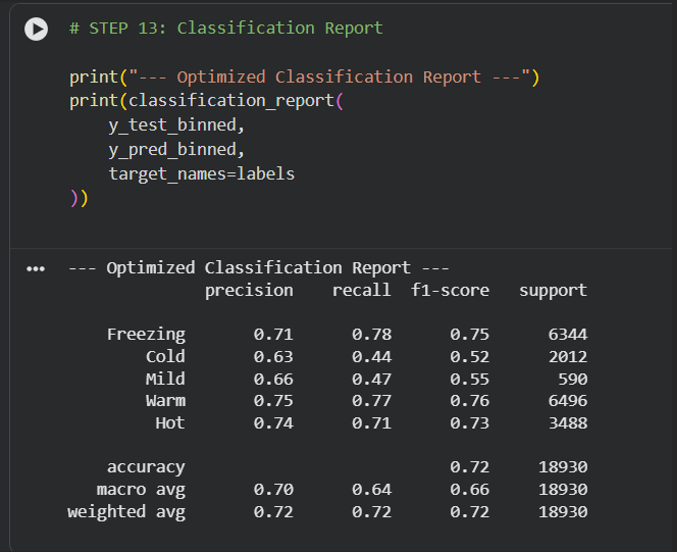

# Temperature Prediction — Szeged, Hungary Weather Data

Predicts hourly temperature (°C) from historical weather data using regression, with an auxiliary classification layer for interpretability. Built for a Neural Networks & Deep Learning course project.

**Contributors:** Basil Haq, Wisam Alam

## Results

| Metric | Baseline (Linear Regression) | Final (Ridge + Polynomial Features) |
|---|---|---|
| R² Score | 0.44 | **0.84** |
| MAE | ~5.8 °C | **~3.0 °C** |
| RMSE | — | ~3.9 °C |

The final model explains ~84% of the variance in temperature and predicts within ±3°C on average. An auxiliary classification layer (binning predictions into Freezing/Cold/Mild/Warm/Hot) reached 72% accuracy, with most errors occurring at category boundaries rather than from large prediction misses.

### Actual vs. Predicted Temperature

Predictions cluster tightly around the ideal 45° line, confirming the regression model's accuracy across the full temperature range.

### Classification Confusion Matrix

Most confusion occurs between adjacent categories (e.g. Cold/Mild, Mild/Warm) at the boundary temperatures — expected behaviour when binning a continuous variable, rather than a sign of poor regression performance.

### Classification Report

## Approach

1. **Data cleaning** — dropped null rows, removed physically invalid zero-value pressure readings (sensor errors), and dropped the `Loud Cover` column (all zeros, no predictive value).
2. **Feature engineering** — the key improvement in the project. Raw physical features alone gave weak results, since temperature is strongly seasonal. Encoded day-of-year cyclically using sine/cosine transforms so the model treats December and January as adjacent rather than numerically distant:
   - `day_sin = sin(2π × day_of_year / 365.25)`
   - `day_cos = cos(2π × day_of_year / 365.25)`
3. **Baseline model** — Linear Regression on raw features (humidity, pressure, wind speed, visibility) → R² of 0.44.
4. **Optimization** — 80/20 train-test split, feature standardization (`StandardScaler`), degree-2 polynomial feature expansion to capture non-linear interactions, and Ridge (L2) regularization to control overfitting from the expanded feature space → R² of 0.84.
5. **Auxiliary classification** — predicted temperatures binned into 5 weather categories to sanity-check the regression output qualitatively.

## Tech stack

Python · pandas · NumPy · scikit-learn · matplotlib · seaborn

## Dataset

[Weather History Dataset — Szeged, Hungary (2006–2016)](https://www.kaggle.com/datasets/budincsevity/szeged-weather), originally sourced from Kaggle. Not included in this repo. To reproduce: download and place as `weatherHistoryy.csv` in the project root.

## Future improvements

- Ensemble models (Random Forest, Gradient Boosting)
- Time-series-specific modelling
- Deep learning approaches for longer-horizon forecasting
